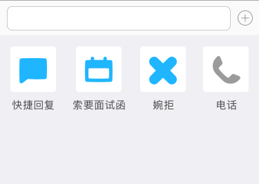
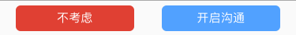

# 沟通

沟通模块，C 在该模块中与 B 进行沟通。

沟通的流程参考「B 端 C 端沟通梳理总结」。

## 功能模块拆分

## 功能描述

### 正在沟通

C 与 B 全部的沟通记录在该模块进行展示，包括已读消息，及新消息。

#### 沟通列表

##### 列表 Cell 展示项

列表中 Cell 的展示包括：沟通的职位名称，公司名称，企业 logo/企业 hr 头像，上次沟通时间，沟通内容 preview。

**职位名称**

对应的职位名称,名称最长为14个字，超过14个字，末尾用「...」表示。

职位名称仅支持中英文，不支持特殊符号。

**公司名称**

公司名称最长为16个字，超过16个字，末尾用「...」表示。

公司名称仅支持中英文，不支持特殊符号。

**企业 logo/企业 hr 头像**

目前展示企业 logo，如企业未上传 logo，展示智联默认 logo。

下一期企业端若给 hr 开通子账号，hr 可独立上传头像，用于与 C 沟通时的展示。

**上次沟通时间**

展示上一次沟通时的时间，规则为：

* 时间在5分钟以内，显示「刚刚」；
* 超过1小时，24小时以内，显示「上午 hh-mm」或者「下午 hh-mm」；
* 超过24小时，48小时以内，显示「昨天」；
* 超过48小时，一周以内，显示「星期几」；
* 超过一周，显示「MM-DD」；

**沟通内容 preview**

沟通内容包括：

- 正常对话文字；
- 面试确认函

正常对话文字，最长为18个字，超过部分用「...」表示；

面试确认函在 preview 中显示：「面试确认函」。

#### 未读消息

##### 未读消息展示

未读消息在列表中通过「红点+数字」展示；

某一条消息未读数字超过了99条后，显示「99+」，不显示具体数量。

##### 新消息推送

在用户下载进入应用后，询问用户打开系统通知。

用户在系统通知开启的状态，若接收到新的沟通消息，App 会进行推送。

#### 沟通详情

##### title

title 展示对应沟通的 hr 的名字

##### 更多

**对话置顶**

把当前对话，在沟通列表中进行置顶。

##### 职位卡片

**查看职位**

查看当前职位的职位名称及薪资范围。职位名称最长为8个字，超过部分用「...」表示；

点击后可以进入对应职位的职位详情页面进行查看，进入后，***该页面没有投递按钮。***

**查看是否打过电话**

电话图标，点亮表示已经拨打过电话，灰色表示还未进行过电话联系。

**查看是否已发送过面试确认函**

面试确认函图标，点亮表示已经发送过面试确认函，灰色表示还未收到面试确认函。已收到面试确认函后，点击图标可以打开面试确认函，查看详情。

##### 消息类型

**文字**

发送文字消息，输入文字。

**快捷回复**

选择快捷回复消息，与 B 进行沟通，快捷回复消息包括：

- 我可以去贵公司面试吗？
- ...

**索要面试函**

按钮，点击后向 B 发送索要面试确认函邀请。B 发出面试确认函后，该按钮置灰，不可点击。

**婉拒**

点击后，自动给企业发送一段话，并关闭聊天窗口，该沟通记录从沟通列表删除，不可恢复。

文案为：对不起，我觉得该职位可能不太适合我。

**电话**

C 在收到了面试确认函以后，电话按钮亮起，C 可以直接点击拨打电话，与 B 沟通。在未收到面试确认函时，电话按钮置灰，不可点击。

### 新的请求

#### 请求列表

##### 列表 Cell 展示项

列表中 Cell 的展示包括：沟通的职位名称，公司名称，企业 logo/企业 hr 头像，上次沟通时间，沟通内容 preview。

有新的消息来只有红点提示，没有具体数字及推送。

**职位名称**

对应的职位名称,名称最长为14个字，超过14个字，末尾用「...」表示。

职位名称仅支持中英文，不支持特殊符号。

**公司名称**

公司名称最长为16个字，超过16个字，末尾用「...」表示。

公司名称仅支持中英文，不支持特殊符号。

**企业 logo/企业 hr 头像**

目前展示企业 logo，如企业未上传 logo，展示智联默认 logo。

下一期企业端若给 hr 开通子账号，hr 可独立上传头像，用于与 C 沟通时的展示。

**上次沟通时间**

展示上一次沟通时的时间，规则为：

* 时间在5分钟以内，显示「刚刚」；
* 超过1小时，24小时以内，显示「上午 hh-mm」或者「下午 hh-mm」；
* 超过24小时，48小时以内，显示「昨天」；
* 超过48小时，一周以内，显示「星期几」；
* 超过一周，显示「MM-DD」；

**沟通内容 preview**

沟通内容包括：

- 正常对话文字；
- 面试确认函

正常对话文字，最长为18个字，超过部分用「...」表示；

面试确认函在 preview 中显示：「面试确认函」。

#### 请求类型

##### 约聊

约聊的请求框，在列表 Cell 中显示的 preview 为：您有一个新的职位邀请；

##### 面试确认函

面试确认函请求框，在列表 Cell 中显示的 preview 为：「新的面试邀请」。

#### 请求详情

##### title

title 展示对应沟通的 hr 的名字

##### 职位卡片

**查看职位**

查看当前职位的职位名称及薪资范围。职位名称最长为8个字，超过部分用「...」表示；

公司名称最长为8个字，超过部分用「...」表示；

点击后可以进入对应职位的职位详情页面进行查看，进入后，***该页面没有投递按钮。***

##### 操作

**开启沟通**

C 对职位有意向，点击开启沟通，该条目进入「正在沟通」列表，C 能与 B 进行聊天；

**不考虑**

C 点击不考虑，退出当前对话框，并在新的请求中删除该条目。

**打开面试确认函**

针对「面试直通车」的用户，将会直接受到面试确认函。用户点击打开，需要询问是否愿意为面试确认函支付，确认函选择支付方式（支付宝/微信）。支付完成后打开面试确认函，该条目进入「正在沟通」列表，C 能与 B 进行聊天；
